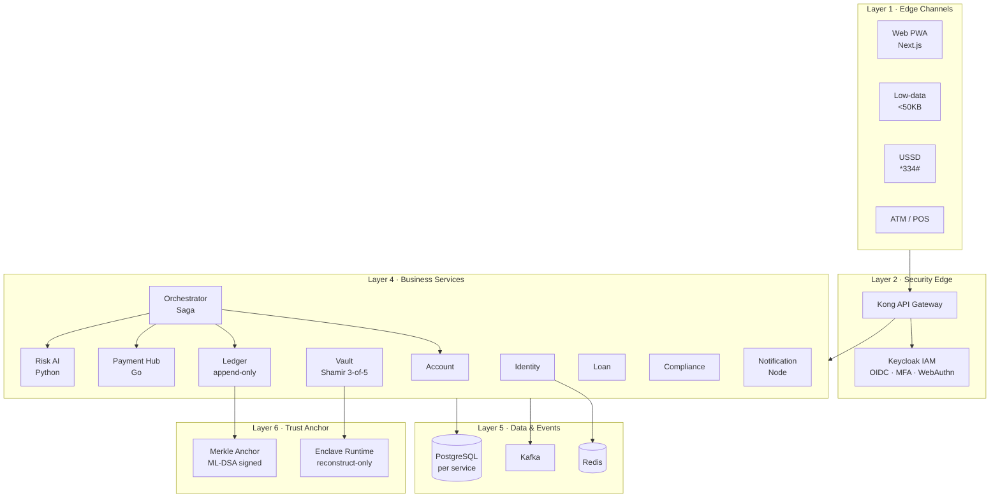

# FINIX — Financial Infrastructure NeXt

**Resilient Inclusive Banking Fabric** · Team Rexosphere · Duothan 6.0 Phase 2 (REBUILD)

A zero-trust, offline-capable banking platform rebuilt from the ground up: no single point of
failure, a cryptographically verifiable ledger, and banking that still works without an internet
connection.

This repository implements the architecture submitted in
[Phase 1 RECON blueprint](docs/phase-1/FINIX_DUOTHAN_6_RECON_Blueprint.pdf).

---

## The problem

A Super Malware Agent has taken the world's banking systems offline. Customer data survived in
backups, but the Master Key that unlocks the banking network is sealed behind security layers.
Rebuilding the old monolith would only recreate the same failure: one shared database, one network
zone, one compromise away from total collapse.

FINIX is designed as a **banking mesh, not a banking app**:

| Failure in the old system | How FINIX answers it |
|---|---|
| Monolith — one compromise takes everything | Independent services, database per service, blast-radius containment |
| Implicit trust inside the network | Zero trust: mTLS everywhere, continuous verification, 5-minute tokens |
| Master Key held by a single custodian | Shamir 3-of-5 split across institutions, reconstructed only inside an enclave |
| Mutable logs — tampering is undetectable | Append-only hash-chained ledger, Merkle-anchored and signed every 60s |
| 100% internet-dependent — excludes rural users | Offline-first vouchers, USSD `*334#`, low-data mode under 50 KB |
| Classical crypto against a 2065 threat model | Post-quantum ML-KEM-768 and ML-DSA-65 |

---

## Architecture



Six layers, ten services, four languages. The polyglot split is deliberate — see
[ADR-0001](docs/adr/0001-faithful-kotlin-core-with-polyglot-edges.md).

---

## Implementation status

This is an in-progress Phase 2 build. The table is the honest state of the repository, not the
target architecture.

| Milestone | Scope | Status |
|---|---|---|
| **M0** | Build system, convention plugins, shared kernel, compose skeleton, CI, ADRs | ✅ Complete |
| **M1** | Identity + auth: Keycloak realm-as-code, PKCE BFF, DPoP, OPA, Vault PKI profile | ✅ Complete |
| **M2** | Money core: account-service, append-only double-entry ledger + hash chain | ✅ Complete |
| **M3** | Saga orchestrator, transactional outbox → Redpanda, AsyncAPI, chaos script | ✅ Complete |
| **M4** | Vault: Shamir + Feldman VSS, custodians, enclave, ceremony UI | ⬜ Planned |
| **M5** | Merkle anchor, proof API, in-browser verification, tamper demo | ⬜ Planned |
| **M6** | PWA, offline vouchers, USSD gateway, `/lite` under 50 KB | ⬜ Planned |
| **M7** | Risk AI, adaptive step-up auth, service quarantine | ⬜ Planned |
| **M8** | Payment Hub, loans, compliance, notifications, admin console | ⬜ Planned |
| **M9** | Full QA suite, load/chaos/DR evidence, user guide | ⬜ Planned |

### What works today

**M0–M3** are in tree and pass `./gradlew verify`:

- **shared-kernel** — Money, JCS, Merkle, PQC, outbox, DPoP, OAuth2 resource-server defaults
- **identity-service** — profiles, devices, login-risk scoring, PKCE authorize/token BFF cookies
- **account-service** — open/list accounts, reserve/commit/release holds, seed personas
- **ledger-service** — balanced double-entry journals, SHA-256 hash chain, append-only DB triggers, `/verify`
- **transaction-orchestrator** — internal-transfer saga with compensation + outbox events
- **infra** — compose core profile (Postgres / Redis / Redpanda / Keycloak + four services), OPA Rego, Keycloak realm JSON

---

## Quick start

Requires **JDK 21**. Nothing else — the Gradle wrapper is pinned to a verified SHA-256.

```bash
git clone https://github.com/Rexosphere/finix.git
cd finix
./gradlew verify
```

`verify` runs the full local gate across every module: compile, unit and property tests,
static analysis, and the coverage threshold.

```bash
./gradlew :shared-kernel:test    # tests only
./gradlew detekt                 # static analysis only
./gradlew integrationTest        # Testcontainers suites (requires Docker)
```

> Integration tests start real PostgreSQL, Kafka and Keycloak containers, so they need a running
> Docker daemon. They are a separate source set and are deliberately excluded from `check`, so the
> main gate stays runnable without Docker.

---

## Repository layout

```
finix/
├── services/
│   ├── build-logic/      Gradle convention plugins — one build contract for every service
│   └── shared-kernel/    Money, canonical JSON, Merkle, post-quantum crypto
├── config/detekt/        Static analysis ruleset
├── docs/adr/             Architecture decision records
└── gradle/               Version catalog + pinned wrapper
```

Services are auto-discovered: any directory under `services/` with a `build.gradle.kts` is included
in the build, so a new service can never be silently left out of `./gradlew verify`.

---

## Quality gates

Every gate below runs as part of `./gradlew verify` and blocks a failing build.

| Gate | Threshold |
|---|---|
| Kotlin compiler | Warnings are errors |
| detekt | Zero issues against `config/detekt/detekt.yml` |
| Line coverage | ≥ 80%, scoped to `domain` / `application` / `crypto` |
| Branch coverage | ≥ 70%, same scope |

Coverage is scoped to the hexagon interior on purpose. Adapters are covered by integration tests
instead, so a single repository-wide percentage would flatter the number without meaning much.

The gates earn their place — while the kernel was being written they caught two real defects:
default-locale number formatting, which would have made ledger hashes differ between machines, and
an off-by-one in the ECMAScript exponent boundary, cross-checked against Node.

---

## Documentation

- [Architecture Decision Records](docs/adr/) — every decision worth challenging, with its rationale
  and its trade-offs

Key decisions so far:

| ADR | Decision |
|---|---|
| [0001](docs/adr/0001-faithful-kotlin-core-with-polyglot-edges.md) | Faithful Spring Boot 3 + Kotlin core, polyglot at the edges |
| [0002](docs/adr/0002-native-platform-bom-over-dependency-management-plugin.md) | Gradle native `platform()` BOM over `io.spring.dependency-management` |
| [0003](docs/adr/0003-logical-database-per-service.md) | Logical database-per-service by default, physical under a profile |
| [0004](docs/adr/0004-ml-dsa-anchor-signatures-instead-of-bls.md) | ML-DSA-65 anchor signatures instead of BLS aggregation |

ADR-0004 is worth reading as a statement of intent: the blueprint promised BLS aggregation, but
BouncyCastle ships no BLS provider and BLS is not post-quantum secure, so it would have contradicted
the blueprint's own security requirements. It is recorded as **not implemented** rather than quietly
claimed. Anything FINIX cannot deliver honestly is documented, not dressed up.

---

## Tech stack

| Layer | Choice |
|---|---|
| Core services | Kotlin 2.3 · Spring Boot 3.5 · JDK 21 (virtual threads) |
| Payment Hub | Go |
| Risk / AI | Python · FastAPI |
| Notifications | Node.js |
| Web | Next.js · TypeScript · Tailwind |
| Data | PostgreSQL per service · Redis · Kafka |
| Identity | Keycloak — OIDC, WebAuthn, TOTP |
| Crypto | BouncyCastle — ML-KEM-768, ML-DSA-65, SHA-256 |
| Build | Gradle 9.6 · convention plugins · version catalog |
| Quality | detekt · JaCoCo · Kotest · Testcontainers · ArchUnit |

---

## Team Rexosphere

| Member | GitHub |
|---|---|
| Sangeeth Kariyapperuma | [@NipunSGeeTH](https://github.com/NipunSGeeTH) |
| Kalana Liyanage | [@Kalana-Pankaja](https://github.com/Kalana-Pankaja) |
| Ifaz Ikram | [@Ifaz-Ikram](https://github.com/Ifaz-Ikram) |
| Suhas Dissanayake | [@SuhasDissa](https://github.com/SuhasDissa) |

Built for **Duothan 6.0** · IEEE Student Branch of NSBM
