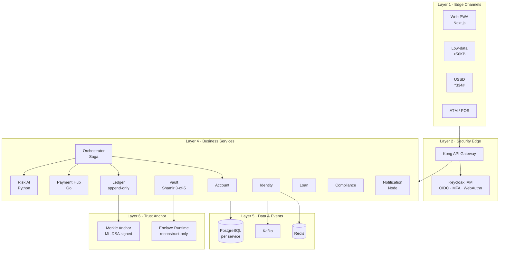

# FINIX — Financial Infrastructure NeXt

**Resilient Inclusive Banking Fabric** · Team Rexosphere · Duothan 6.0 Phase 2 (REBUILD)

A zero-trust, offline-capable banking platform rebuilt from the ground up: no single point of
failure, a cryptographically verifiable ledger, and banking that still works without an internet
connection.

This repository implements the architecture submitted in
[Phase 1 RECON blueprint](docs/phase-1/FINIX_DUOTHAN_6_RECON_Blueprint.pdf).

---

## What is this?

FINIX is a **hackathon demo banking platform** — a serious rebuild of banking for a scenario where a
cyberattack has taken traditional systems offline. It is not a single monolith app; it is a **mesh
of smaller services** (identity, accounts, ledger, payments, risk, and more) that keep working under
failure, offline conditions, and strict security.

**What it shows:**

- Banking that still works **offline**, on **low-data** pages, and over **USSD** (`*334#`)
- Strong security: zero-trust, short-lived tokens, master-key recovery only inside an enclave
- A **tamper-evident ledger** you can verify was not altered
- Multiple channels: web PWA, lite page, admin console, USSD simulator

**What “running it” means:** Docker starts the gateway, databases, Kafka, Keycloak, and the banking
services. You then open the web/admin UIs and walk through the demo.

**Two ways to start:** use our **published images** (Docker only — fastest for new users), or
**build everything yourself** from this repo if you prefer. Same demo either way — see
[How to run](#how-to-run), then [docs/DEMO.md](docs/DEMO.md).

---

## The problem

A Super Malware Agent has taken the world's banking systems offline. Customer data survived in
backups, but the Master Key that unlocks the banking network is sealed behind security layers.
Rebuilding the old monolith would only recreate the same failure: one shared database, one network
zone, one compromise away from total collapse.

FINIX is designed as a **banking mesh, not a banking app**:

| Failure in the old system | How FINIX answers it |
|---|---|
| Monolith — one compromise takes everything | Independent services, database per service, blast-radius containment |
| Implicit trust inside the network | Zero trust: mTLS everywhere, continuous verification, 5-minute tokens |
| Master Key held by a single custodian | Shamir 3-of-5 split across institutions, reconstructed only inside an enclave |
| Mutable logs — tampering is undetectable | Append-only hash-chained ledger, Merkle-anchored and signed every 60s |
| 100% internet-dependent — excludes rural users | Offline-first vouchers, USSD `*334#`, low-data mode under 50 KB |
| Classical crypto against a 2065 threat model | Post-quantum ML-KEM-768 and ML-DSA-65 |

---

## Architecture



Six layers, ten services, four languages. The polyglot split is deliberate — see
[ADR-0001](docs/adr/0001-faithful-kotlin-core-with-polyglot-edges.md).

---

## Implementation status

This is an in-progress Phase 2 build. The table is the honest state of the repository, not the
target architecture.

| Milestone | Scope | Status |
|---|---|---|
| **M0** | Build system, convention plugins, shared kernel, compose skeleton, CI, ADRs | ✅ Complete |
| **M1** | Identity + auth: Keycloak realm-as-code, PKCE BFF, DPoP, OPA, Vault PKI profile | ✅ Complete |
| **M2** | Money core: account-service, append-only double-entry ledger + hash chain | ✅ Complete |
| **M3** | Saga orchestrator, transactional outbox → Redpanda, AsyncAPI, chaos script | ✅ Complete |
| **M4** | Vault: Shamir + Feldman VSS, custodians, enclave, ceremony UI | ✅ Complete |
| **M5** | Merkle anchor, proof API, in-browser verification, tamper demo | ✅ Complete |
| **M6** | PWA, offline vouchers, USSD gateway, `/lite` under 50 KB | ✅ Complete |
| **M7** | Risk AI, adaptive step-up auth, service quarantine | ✅ Complete |
| **M8** | Payment Hub, loans, compliance, notifications, admin console | ✅ Complete |
| **M9** | Full QA suite, load/chaos/DR evidence, user guide | ✅ Complete |

### What works today

**M0–M9** are in tree. JVM modules pass `./gradlew verify`; polyglot edges have their own tests:

- **shared-kernel** — Money, JCS, Merkle, PQC, outbox, DPoP, OAuth2 resource-server defaults
- **identity-service** — profiles, devices, login-risk scoring, PKCE authorize/token BFF cookies
- **account-service** — open/list accounts, reserve/commit/release holds, seed personas, offline voucher register/reconcile + double-spend quarantine
- **ledger-service** — balanced double-entry journals, SHA-256 hash chain, append-only DB triggers, `/verify`, ML-DSA Merkle anchors + proof + tamper demo
- **transaction-orchestrator** — internal-transfer saga with risk gating (`allow` / `AWAITING_STEP_UP` / `BLOCKED`) + compensation + outbox events
- **vault-service** — Shamir 3-of-5 + Feldman VSS, hybrid-sealed custodian shards, ceremony workflow
- **enclave-runtime** — attestation, reconstruct-only path with key zeroing
- **ussd-gateway** — Africa's Talking `POST /ussd` for `*334#` (balance, send, mini-statement, language) with Redis sessions
- **risk-ai-service** — IsolationForest + rules (`/v1/score`), login enrichment, AI Shield quarantine, FedAvg demo; model card in `docs/model-card-risk-ai.md`
- **loan-service** — SME micro-loans with deterministic credit decision + repayment schedule
- **compliance-service** — AML/sanctions/SAR cases + party screening + risk-case ingest
- **payment-hub** (Go) — LankaPay/Visa/CBDC connectors + ISO 20022 pacs.008
- **notification-service** (Node) — SMS/email/push/voice templates in si/ta/en
- **Keycloak SPI** — `infra/keycloak/spi` adaptive authenticator calls identity `/login-risk`
- **apps/web** — offline PWA, USSD simulator, zero-JS `/lite.html` (&lt;50 KB CI budget), ledger verify
- **apps/admin** — ops console: ceremony, risk/shield, compliance, loans, payments, notifications
- **docs** — [USER-GUIDE](docs/USER-GUIDE.md), [FIDELITY-MATRIX](docs/FIDELITY-MATRIX.md), [DEMO](docs/DEMO.md), QA + runbooks
- **infra** — compose core profile wires the full demo stack

---

## How to run

Pick one path — both end in the same running demo.

| Path | Who it’s for | Needs | Command |
|---|---|---|---|
| **Use published images** | New users, judges, quick try | Docker only | `make demo-pull` |
| **Build yourself** | Contributors, offline/air-gapped, prefer source | Docker + JDK 21 | `make demo` |

```bash
git clone https://github.com/Rexosphere/finix.git
cd finix
```

### Use published images (recommended for new users)

No local Gradle build. Images are published to GHCR on every push to `master` / `main`
(`ghcr.io/rexosphere/finix/<service>:latest`):

```bash
make demo-pull
```

That pulls the images, starts the stack, waits until healthy, seeds personas, and prints URLs.
Then open the links below and follow [docs/DEMO.md](docs/DEMO.md).

| URL | What |
|---|---|
| http://localhost:3000 | **Demo app** (PWA / lite / USSD) — use demo users here |
| http://localhost:3001 | Admin / vault ceremony |
| http://localhost:8081 | Keycloak admin console — user `admin`, password printed by the startup banner |

**Credentials are generated, never committed.** `make demo` / `make demo-pull` run
`./scripts/gen-secrets.sh` first, which writes one random password per component into
`infra/compose/secrets/` (gitignored) and mounts them as Docker secrets. The startup banner
prints the Keycloak login; reprint the console logins any time with:

```bash
./scripts/gen-secrets.sh --show
```

**Demo users** (password `Finix!2026` for all): `farmer@finix.lk`, `sme@finix.lk`,
`elder@finix.lk`, `regulator@finix.lk`.

They live in the **finix** realm. They will **not** work on the Keycloak admin page at
`:8081` (that is the **master** realm). Use the web app at `:3000`, or open the finix realm
login at http://localhost:8081/realms/finix/account .

Pin a specific commit build:

```bash
FINIX_IMAGE_TAG=sha-<shortsha> make demo-pull
```

If `docker pull` fails with unauthorized, make the GHCR packages public (org settings), or
`docker login ghcr.io` with a PAT that can read packages.

### Build yourself (optional)

Prefer not to pull prebuilt images? Build and run from this repository instead — same stack,
same seed data, same URLs:

```bash
make demo
```

Needs **Docker** and **JDK 21**.

### Updating only what changed

You do **not** need to republish every image for a small change.

| What you changed | What to do |
|---|---|
| `apps/web` or `apps/admin` | Already mounted into nginx — refresh the browser (restart web/admin if needed) |
| `infra/keycloak/finix-realm.json` | `docker compose … restart keycloak` (realm file is bind-mounted; no image publish) |
| One service, e.g. `identity-service` | Locally: `make rebuild SERVICE=identity-service` |
| One service → GHCR for others | GitHub → Actions → **Publish images** → Run workflow → set `services` to e.g. `identity-service` (comma-separated, or `all`) |

Local rebuild example (keeps the rest of the pulled stack):

```bash
make rebuild SERVICE=account-service
```

### Useful Make targets

| Command | What it does |
|---|---|
| `make demo-pull` | Pull GHCR images, start, wait healthy, seed, print URLs |
| `make demo` | Build locally, start, wait healthy, seed, print URLs |
| `make up-pull` | Pull + start only (no wait/seed) |
| `make up` | Start with local image build (no wait/seed) |
| `make rebuild SERVICE=…` | Rebuild + recreate one service locally |
| `make seed` | Seed personas into a running stack |
| `make logs` | Tail compose logs |
| `make monitoring` | Start Prometheus + Grafana + Loki + Tempo + Alertmanager |
| `make monitoring-down` | Stop the monitoring profile, leaving the stack up |
| `make secrets` | Generate this machine's credentials and print the console logins |
| `make vault-demo` | Run the full profile with credentials served from Vault (ADR-0006) |
| `make scale SERVICE=… N=…` | Scale a stateless service behind nginx |
| `make hooks` | Install the pre-commit hook |
| `make provision` | Converge the production host with Ansible (idempotent) |
| `make backup` / `make restore` | Take or restore a Postgres dump |
| `make down` | Stop the stack and remove volumes |

`make help` lists everything.

### Observability

`make monitoring` brings up the `monitoring` profile — Prometheus, Grafana, Loki, Tempo,
Alertmanager, Grafana Alloy, a blackbox exporter, and exporters for the host, containers, Postgres
and Redis. Grafana lands on <http://localhost:3002> (user `admin`; the password is generated —
`./scripts/gen-secrets.sh --show`) with dashboards pre-provisioned from
`infra/monitoring/grafana/dashboards/`.

All three pillars are joined: a log line links to its trace (Loki derived field → Tempo), a span
links back to that service's logs and metrics, and Alertmanager groups and inhibits the alert rules
in `infra/monitoring/prometheus/rules/`. Traces are exported only when sampling is on —
`FINIX_TRACE_SAMPLE=1.0` alongside `make monitoring`.

Every service exposes request metrics under the same names. The Spring Boot services get
`http_server_requests_seconds` from Micrometer for free; the Go, Python and Node services emit the
same metric name and the same `uri` / `method` / `status` / `outcome` labels by hand, so one Grafana
panel covers all of them rather than one panel per language.

`uri` is always the *route template* (`/v1/payments/{id}`), never the raw path — a payment id in the
label would give the series unbounded cardinality.

Logs are shipped by Alloy straight off the Docker socket into Loki, labelled with the compose
service name so a log query and a metric query filter on the same `service` value.

In production the stack is part of the `full` profile, so it deploys with everything else; Grafana
is published on `127.0.0.1:3002` only and reached through Caddy at
<https://grafana.roboti.qzz.io>. Its password is a Docker secret generated on the server and is
never committed.

### Local build / tests only

Requires **JDK 21**. The Gradle wrapper is pinned to a verified SHA-256 — nothing else to install
for compile/unit tests.

```bash
./gradlew verify                 # full local gate (compile + tests + coverage + detekt)
./gradlew :shared-kernel:test    # tests only
./gradlew detekt                 # static analysis only
./gradlew integrationTest        # Testcontainers suites (requires Docker)
```

`verify` runs the full local gate across every module: compile, unit and property tests,
static analysis, and the coverage threshold.

> Integration tests start real PostgreSQL, Kafka and Keycloak containers, so they need a running
> Docker daemon. They are a separate source set and are deliberately excluded from `check`, so the
> main gate stays runnable without Docker.

---

## Repository layout

```
finix/
├── services/
│   ├── build-logic/      Gradle convention plugins — one build contract for every service
│   └── shared-kernel/    Money, canonical JSON, Merkle, post-quantum crypto
├── config/detekt/        Static analysis ruleset
├── docs/adr/             Architecture decision records
└── gradle/               Version catalog + pinned wrapper
```

Services are auto-discovered: any directory under `services/` with a `build.gradle.kts` is included
in the build, so a new service can never be silently left out of `./gradlew verify`.

---

## Quality gates

Every gate below runs as part of `./gradlew verify` and blocks a failing build.

| Gate | Threshold |
|---|---|
| Kotlin compiler | Warnings are errors |
| detekt | Zero issues against `config/detekt/detekt.yml` |
| Line coverage | ≥ 80%, scoped to `domain` / `application` / `crypto` |
| Branch coverage | ≥ 70%, same scope |

Coverage is scoped to the hexagon interior on purpose. Adapters are covered by integration tests
instead, so a single repository-wide percentage would flatter the number without meaning much.

The gates earn their place — while the kernel was being written they caught two real defects:
default-locale number formatting, which would have made ledger hashes differ between machines, and
an off-by-one in the ECMAScript exponent boundary, cross-checked against Node.

---

## Documentation

- [USER-GUIDE.md](docs/USER-GUIDE.md) — graded operator guide
- [FIDELITY-MATRIX.md](docs/FIDELITY-MATRIX.md) — every Phase-1 claim → status + evidence
- [DEMO.md](docs/DEMO.md) — 12-minute judge script
- [Architecture Decision Records](docs/adr/) — every decision worth challenging, with its rationale
  and its trade-offs
- [EVIDENCE.md](docs/EVIDENCE.md) — each engineering practice → the files that implement it and a
  command that proves it, including what is deliberately not done
- [CONTRIBUTING.md](CONTRIBUTING.md) — setup, the loop, and which rules are enforced rather than suggested
- [QA strategy](docs/qa/TEST-STRATEGY.md) · [Runbooks](docs/runbooks/)

Key decisions so far:

| ADR | Decision |
|---|---|
| [0001](docs/adr/0001-faithful-kotlin-core-with-polyglot-edges.md) | Faithful Spring Boot 3 + Kotlin core, polyglot at the edges |
| [0002](docs/adr/0002-native-platform-bom-over-dependency-management-plugin.md) | Gradle native `platform()` BOM over `io.spring.dependency-management` |
| [0003](docs/adr/0003-logical-database-per-service.md) | Logical database-per-service by default, physical under a profile |
| [0004](docs/adr/0004-ml-dsa-anchor-signatures-instead-of-bls.md) | ML-DSA-65 anchor signatures instead of BLS aggregation |
| [0006](docs/adr/0006-generated-docker-secrets-with-vault-as-runtime-source.md) | Generated Docker secrets, with Vault as the runtime source of truth |
| [0007](docs/adr/0007-deploy-published-images-not-server-builds.md) | Deploy published images, never build on the server |

ADR-0004 is worth reading as a statement of intent: the blueprint promised BLS aggregation, but
BouncyCastle ships no BLS provider and BLS is not post-quantum secure, so it would have contradicted
the blueprint's own security requirements. It is recorded as **not implemented** rather than quietly
claimed. Anything FINIX cannot deliver honestly is documented, not dressed up.

---

## Tech stack

| Layer | Choice |
|---|---|
| Core services | Kotlin 2.3 · Spring Boot 3.5 · JDK 21 (virtual threads) |
| Payment Hub | Go |
| Risk / AI | Python · FastAPI |
| Notifications | Node.js |
| Web | Next.js · TypeScript · Tailwind |
| Data | PostgreSQL per service · Redis · Kafka |
| Identity | Keycloak — OIDC, WebAuthn, TOTP |
| Crypto | BouncyCastle — ML-KEM-768, ML-DSA-65, SHA-256 |
| Build | Gradle 9.6 · convention plugins · version catalog |
| Quality | detekt · JaCoCo · Kotest · Testcontainers · ArchUnit |

---

## Team Rexosphere

| Member | GitHub |
|---|---|
| Sangeeth Kariyapperuma | [@NipunSGeeTH](https://github.com/NipunSGeeTH) |
| Kalana Liyanage | [@Kalana-Pankaja](https://github.com/Kalana-Pankaja) |
| Ifaz Ikram | [@Ifaz-Ikram](https://github.com/Ifaz-Ikram) |
| Suhas Dissanayake | [@SuhasDissa](https://github.com/SuhasDissa) |

Built for **Duothan 6.0** · IEEE Student Branch of NSBM
